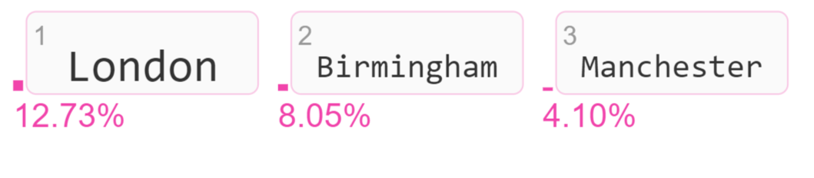
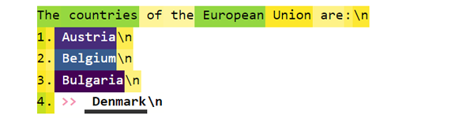
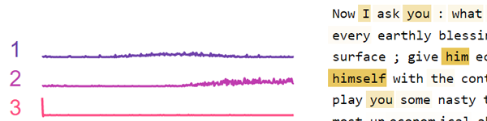

<br />
<br />

<!--- BADGES: START --->
[][#github-license]
[][#pypi-package]
[][#pypi-package]
[][#conda-forge-package]
[][#conda-forge-package]
[][#docs-package]


[#github-license]: https://github.com/jalammar/ecco/blob/main/LICENSE
[#pypi-package]: https://pypi.org/project/ecco/
[#conda-forge-package]: https://anaconda.org/conda-forge/ecco
[#docs-package]: https://ecco.readthedocs.io/
<!--- BADGES: END --->


Ecco is a python library for exploring and explaining Natural Language Processing models using interactive visualizations. 


Ecco provides multiple interfaces to aid the explanation and intuition of [Transformer](https//jalammar.github.io/illustrated-transformer/)-based language models. Read: [Interfaces for Explaining Transformer Language Models](https://jalammar.github.io/explaining-transformers/).

Ecco runs inside Jupyter notebooks. It is built on top of [pytorch](https://pytorch.org/) and [transformers](https://github.com/huggingface/transformers).


Ecco is not concerned with training or fine-tuning models. Only exploring and understanding existing pre-trained models. The library is currently an alpha release of a research project. You're welcome to contribute to make it better!


Documentation: [ecco.readthedocs.io](https://ecco.readthedocs.io/)

## Features
- Support for a wide variety of language models (GPT2, BERT, RoBERTA, T5, T0, and others) [[notebook & instructions for adding more models](https://github.com/jalammar/ecco/blob/main/notebooks/Identifying%20model%20configuration.ipynb)].
- Ability to add your own **local models** (if they're based on Hugging Face pytorch models).
- **Feature attribution** ([IntegratedGradients](https://arxiv.org/abs/1703.01365), [Saliency](https://arxiv.org/abs/1312.6034), [InputXGradient](https://arxiv.org/abs/1412.6815), [DeepLift](https://arxiv.org/abs/1704.02685), [DeepLiftShap](https://proceedings.neurips.cc/paper/2017/hash/8a20a8621978632d76c43dfd28b67767-Abstract.html), [GuidedBackprop](https://arxiv.org/abs/1412.6806), [GuidedGradCam](https://arxiv.org/abs/1610.02391), [Deconvolution](https://arxiv.org/abs/1311.2901), and [LRP](https://journals.plos.org/plosone/article?id=10.1371/journal.pone.0130140) via [Captum](https://captum.ai/))
- **Capture neuron activations** in the FFNN layer in the Transformer block
- Identify and **visualize neuron activation patterns**  (via Non-negative Matrix Factorization)
- Examine neuron activations via comparisons of activations spaces using [SVCCA](https://arxiv.org/abs/1706.05806), [PWCCA](https://arxiv.org/abs/1806.05759), and [CKA](https://arxiv.org/abs/1905.00414) (See [this video on inspecting neural networks with CCA](https://www.youtube.com/watch?v=u7Dvb_a1D-0))
- Visualizations for:
    - Evolution of processing a token through the layers of the model ([Logit lens](https://www.lesswrong.com/posts/AcKRB8wDpdaN6v6ru/interpreting-gpt-the-logit-lens))
    - Candidate output tokens and their probabilities (at each layer in the model)

## Installation

You can install `ecco` either with `pip` or with `conda`.

**with pip**

```sh
pip install ecco
```

**with conda**

```sh
conda install -c conda-forge ecco
```

## Examples:
You can run all these examples from this [[notebook](https://github.com/jalammar/ecco/blob/main/notebooks/readme.md%20examples.ipynb)] | [[colab](https://colab.research.google.com/github/jalammar/ecco/blob/main/notebooks/readme.md%20examples.ipynb)].
### What is the sentiment of this film review?


Use a large language model (T5 in this case) to detect text sentiment. In addition to the sentiment, see the tokens the model broke the text into (which can help debug some edge cases).

### Which words in this review lead the model to classify its sentiment as "negative"?


Feature attribution using Integrated Gradients helps you explore model decisions. In this case, switching "weakness" to "inclination" allows the model to correctly switch the prediction to *positive*.

### Explore the world knowledge of GPT models by posing fill-in-the blank questions.


Does GPT2 know where Heathrow Airport is? Yes. It does.

### What other cities/words did the model consider in addition to London?


Visualize the candidate output tokens and their probability scores.

### Which input words lead it to think of London?


### At which layers did the model gather confidence that London is the right answer?


The model chose London by making the highest probability token (ranking it #1) after the last layer in the model. How much did each layer contribute to increasing the ranking of *London*? This is a [logit lens](https://www.lesswrong.com/posts/AcKRB8wDpdaN6v6ru/interpreting-gpt-the-logit-lens) visualizations that helps explore the activity of different model layers.

### What are the patterns in BERT neuron activation when it processes a piece of text? 


A group of neurons in BERT tend to fire in response to commas and other punctuation. Other groups of neurons tend to fire in response to pronouns. Use this visualization to factorize neuron activity in individual FFNN layers or in the entire model.


Read the paper: 
>[Ecco: An Open Source Library for the Explainability of Transformer Language Models](https://aclanthology.org/2021.acl-demo.30/)
> Association for Computational Linguistics (ACL) System Demonstrations, 2021


## Tutorials
- Video: [Take A Look Inside Language Models With Ecco](https://www.youtube.com/watch?v=rHrItfNeuh0). \[<a href="https://colab.research.google.com/github/jalammar/ecco/blob/main/notebooks/Language_Models_and_Ecco_PyData_Khobar.ipynb">Colab Notebook</a>]


## How-to Guides
- [Interfaces for Explaining Transformer Language Models](https://jalammar.github.io/explaining-transformers/)
- [Finding the Words to Say: Hidden State Visualizations for Language Models](https://jalammar.github.io/hidden-states/)


## API Reference
The [API reference](https://ecco.readthedocs.io/en/main/api/ecco/) and the [architecture](https://ecco.readthedocs.io/en/main/architecture/) page explain Ecco's components and how they work together.

## Gallery & Examples

<div class="container gallery" markdown="1">

<p><strong>Predicted Tokens:</strong> View the model's prediction for the next token (with probability scores). See how the predictions evolved through the model's layers. [<a href="https://github.com/jalammar/ecco/blob/main/notebooks/Ecco_Output_Token_Scores.ipynb">Notebook</a>] [<a href="https://colab.research.google.com/github/jalammar/ecco/blob/main/notebooks/Ecco_Output_Token_Scores.ipynb">Colab</a>]</p>

<hr />
<p><strong>Rankings across layers:</strong> After the model picks an output token, Look back at how each layer ranked that token.  [<a href="https://github.com/jalammar/ecco/blob/main/notebooks/Ecco_Evolution_of_Selected_Token.ipynb">Notebook</a>] [<a href="https://colab.research.google.com/github/jalammar/ecco/blob/main/notebooks/Ecco_Evolution_of_Selected_Token.ipynb">Colab</a>]</p>

<hr />
<p><strong>Layer Predictions:</strong>Compare the rankings of multiple tokens as candidates for a certain position in the sequence.  [<a href="https://github.com/jalammar/ecco/blob/main/notebooks/Ecco_Comparing_Token_Rankings.ipynb">Notebook</a>] [<a href="https://colab.research.google.com/github/jalammar/ecco/blob/main/notebooks/Ecco_Comparing_Token_Rankings.ipynb">Colab</a>]</p>

<hr />
<p><strong>Primary Attributions:</strong> How much did each input token contribute to producing the output token?   [<a href="https://github.com/jalammar/ecco/blob/main/notebooks/Ecco_Primary_Attributions.ipynb">Notebook</a>] [<a href="https://colab.research.google.com/github/jalammar/ecco/blob/main/notebooks/Ecco_Primary_Attributions.ipynb">Colab</a>]
</p>


<hr />
<p><strong>Detailed Primary Attributions:</strong> See more precise input attributions values using the detailed view. [<a href="https://github.com/jalammar/ecco/blob/main/notebooks/Ecco_Primary_Attributions.ipynb">Notebook</a>] [<a href="https://colab.research.google.com/github/jalammar/ecco/blob/main/notebooks/Ecco_Primary_Attributions.ipynb">Colab</a>]
</p>


<hr />
<p><strong>Neuron Activation Analysis:</strong> Examine underlying patterns in neuron activations using non-negative matrix factorization. [<a href="https://github.com/jalammar/ecco/blob/main/notebooks/Ecco_Neuron_Factors.ipynb">Notebook</a>] [<a href="https://colab.research.google.com/github/jalammar/ecco/blob/main/notebooks/Ecco_Neuron_Factors.ipynb">Colab</a>]</p>


</div>

## Getting Help
Having trouble?

- The [Discussion](https://github.com/jalammar/ecco/discussions) board might have some relevant information. If not, you can post your questions there.
- Report bugs at Ecco's [issue tracker](https://github.com/jalammar/ecco/issues)


Bibtex for citations:
```bibtex
@inproceedings{alammar-2021-ecco,
    title = "Ecco: An Open Source Library for the Explainability of Transformer Language Models",
    author = "Alammar, J",
    booktitle = "Proceedings of the 59th Annual Meeting of the Association for Computational Linguistics and the 11th International Joint Conference on Natural Language Processing: System Demonstrations",
    year = "2021",
    publisher = "Association for Computational Linguistics",
}
```
